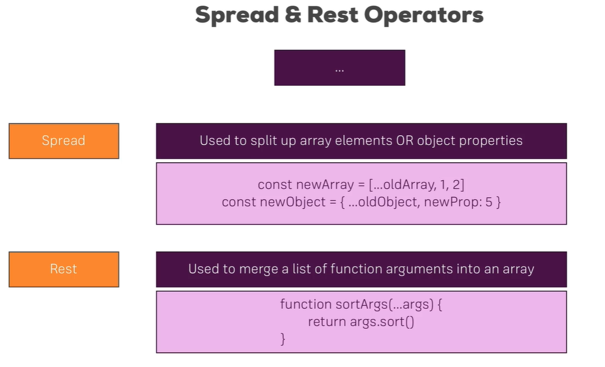
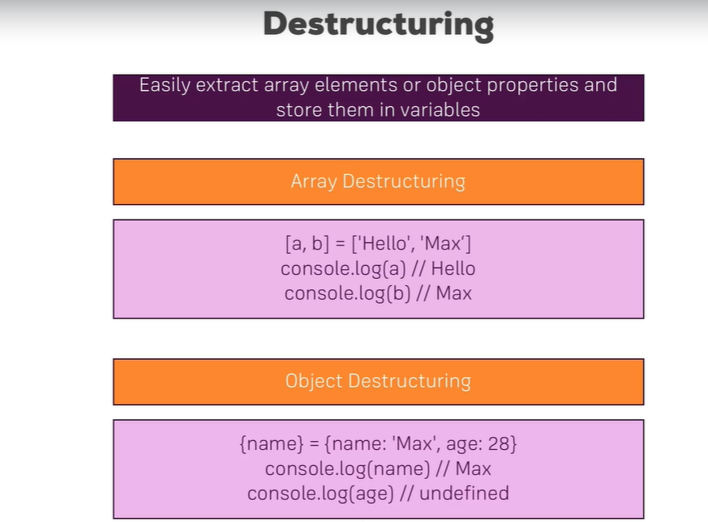
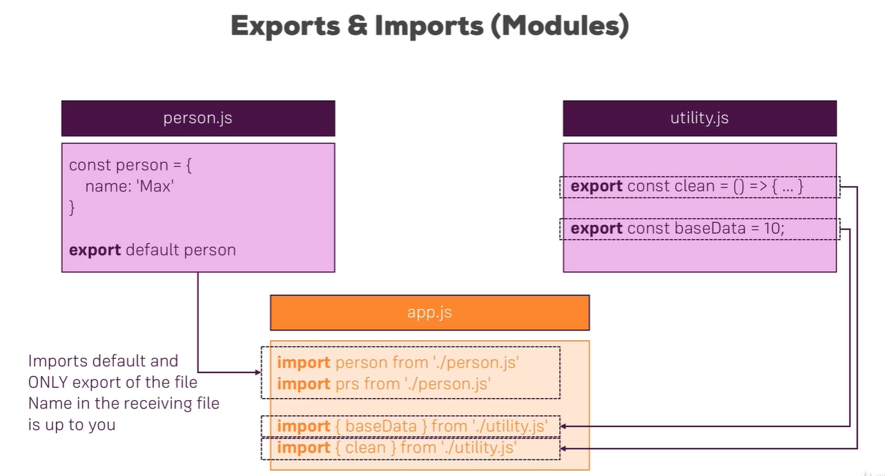
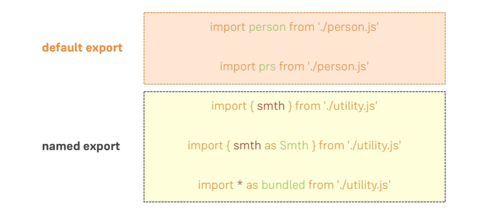

# Internal Apps
+ Internal Apps a web based application which shows all the applications that are used in a company. It was developed in ~~React js~~.

## Why do we need Js Framework/Library.

+ Framework/Library is something that reduces developers work easy.

+ comparision between Java and Javascript.


Java|Javascript
--- |---
servlet|Javascript
jsp|jqeury
structs|Angular 1.x,ember etc.,
Spring,Spring Boot|React,Angular 2+,Vue,selvte.
   
+ Advantages of JQuery over Javascript.

  * syntax is very easy.
  ```javascript
    var classNames=document.getElementsbyClassName('cssClass');//
    var headerClass = classNames[0];
    console.log(headerClass.value);// 👎👎


    <!-- if we compare it with jquery  -->

    $('.cssClass')[0].val(); 👍👍
  ```
  * Cross-Browser Support.

  * Ajax is made simple.

  ```javascript
  var xhttp = new XMLHttpRequest();
  xhttp.onreadystatechange = function() {
    if (this.readyState == 4 && this.status == 200) {
       // Typical action to be performed when the document is ready:
       document.getElementById("demo").innerHTML = xhttp.responseText;
    }
  };
    xhttp.open("GET", "filename", true);
    xhttp.send();//Difficult to use 😟😟👎


  <!-- if we compare it with jquery  -->

   $.ajax({url: "demo_test.txt", success: function(result){
       // Typical action to be performed when the document is ready:
  }});//Easy to use 😄😄👍
   ```
+ disadvantages of Jquery
  * all the features of Jquery has been added to latest versions of Javascript.
  * size of Jquery library is huge.
  * Unit Testing is difficult.
  * All the Jquery elements and plugins are global, which reduces performance.
  * Difficult to work in MVC pattern.

+ Comparision of React with other Frameworks/Libraries

Type|React|Angular|Vue
---|---|---|---
size|less|more|more
learning curve|easy|difficult|easy
popularity|high⏩|medium|medium
Open Source| 👍|👍|👍
Developed by|Facebook|google|Open Source

<br/>
<br/><br/><br/><br/><br/><br/><br/><br/><br/><br/><br/><br/><br/><br/><br/><br/><br/><br/><br/><br/><br/><br/>


+ JavaScript(ES6) Features
  * Understanding var,let and const.

  * Arrow Functions.

  * Array Functions.
  * default parameters,Spread and Rest operator `...`,
  

  * destructring.
  
  * import and export.




 
